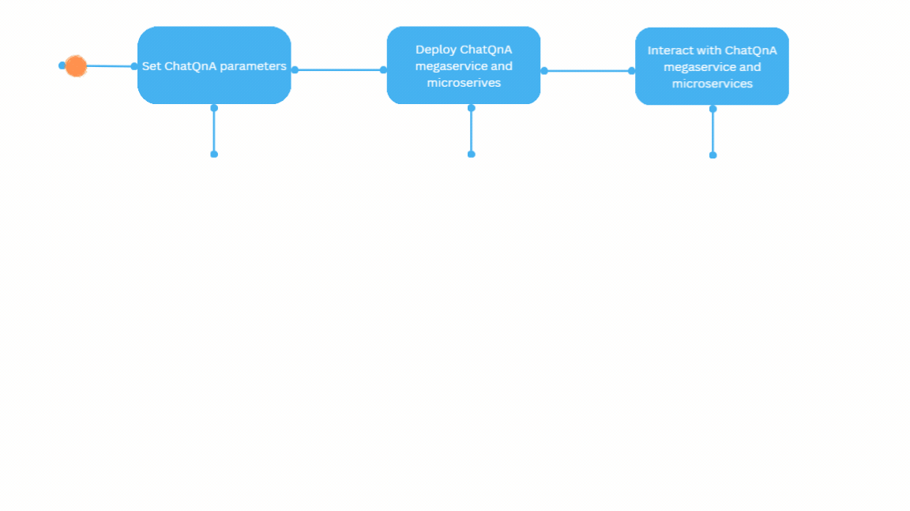
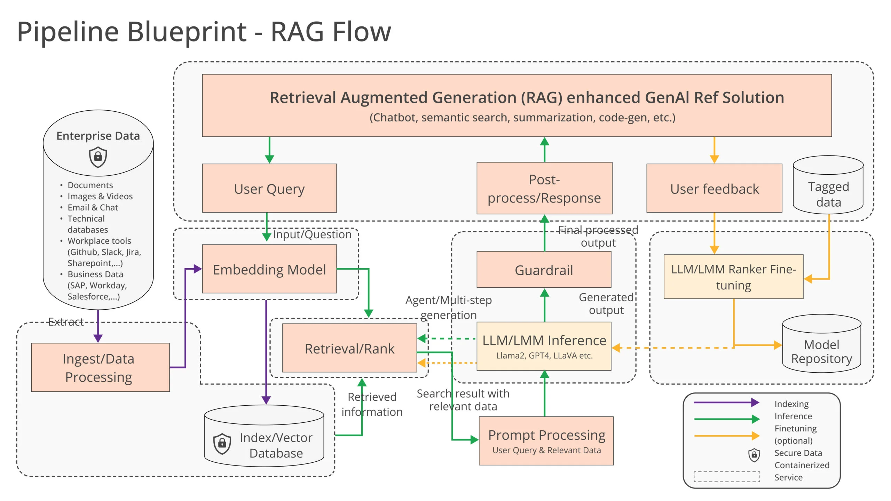

# OPEA Cluster Builder

In today’s fast-paced industry, staying up to date with the tools and best practices for building secure, reliable, and high-performance GenAI applications can be a real challenge. The rapid evolution of AI models, combined with the increasing complexity of deployment environments, means developers must constantly navigate new technologies, frameworks, and scalability concerns. Security, data integrity, and compliance standards add further pressure, making it critical to ensure applications not only perform well but also adhere to industry requirements.

For enterprises, the ability to implement AI solutions efficiently without sacrificing quality or time to market is essential for maintaining competitiveness. This demand for quick, scalable, and secure AI solutions requires a robust and streamlined approach, which is exactly where GenAI applications powered by tools like OPEA come in. By simplifying the deployment process and integrating best practices, OPEA helps developers overcome these challenges and deliver AI applications that meet enterprise demands. 

## Key Technologies

[OPEA (Open Platform for Enterprise AI)](https://opea.dev)is an open source project under the *LF & AI Data Foundation* that provides a framework for enabling the creation and evaluation of open, multi-provider, robust, and composable generative AI (GenAI) solutions. OPEA simplifies the implementation of enterprise-grade composite GenAI solutions, starting with a focus on retrieval augmented generation (RAG). The platform is designed to facilitate the efficient integration and deployment of secure, performant, and cost-effective GenAI workflows into business systems , leading to quicker GenAI adoption and business value.

### What is Retrieval Augmented Generation (RAG)?
RAG is a technique that combines two powerful AI capabilities: information retrieval and large language model (LLM) generation. Instead of relying solely on the LLM’s knowledge, RAG pulls in relevant, up-to-date information from external data sources, such as databases or documents, to augment the model's responses. This enhances accuracy and relevance and helps reduce hallucinations, especially for enterprise use cases where real-time or domain-specific knowledge is critical.

[More on RAG](https://medium.com/p/4d1d08f736b3)


### OPEA Project Architecture
OPEA uses microservices to create high-quality GenAI applications for enterprises, simplifying the scaling and deployment process for production. These microservices leverage a service composer that assembles them into a megaservice thereby creating real-world enterprise AI applications.

The GenAI Microservices documentation describes a suite of microservices. Each microservice is designed to perform a specific function or task within the application architecture. By breaking down the system into these smaller, self-contained services, microservices promote modularity, flexibility, and scalability. This modular approach allows developers to independently develop, deploy, and scale individual components of the application, making it easier to maintain and evolve over time. All of the microservices are containerized, allowing cloud native deployment.

Megaservices are higher-level architectural constructs composed of one or more microservices. Unlike individual microservices, which focus on specific tasks or functions, a megaservice orchestrates multiple microservices to deliver a comprehensive solution. Megaservices encapsulate complex business logic and workflow orchestration, coordinating the interactions between various microservices to fulfill specific application requirements. This approach enables the creation of modular, yet integrated, applications. You can find a collection of use case-based applications in the GenAI Examples documentation.

The Gateway serves as the interface for users to access a megaservice, providing customized access based on user requirements. A gatewayacts as the entry point for incoming requests, routing them to the appropriate microservices within the megaservice architecture.

Gateways support API definition, API versioning, rate limiting, and request transformation, allowing for fine-grained control over how users interact with the underlying microservices. By abstracting the complexity of the underlying infrastructure, gateways provide a seamless and user-friendly experience for interacting with the megaservice.

## Getting Started

### Prerequisites
To get started with OPEA you need the right hardware and basic software setup.

### Hardware Requirements
If you need Hardware Access visit the [Intel Tiber Developer Cloud](https://cloud.intel.com/) to select from options such as Xeon or Gaudi processors that meet the necessary specifications.

### Software Requirements
Refer to the [Support Matrix](https://opea-project.github.io/latest/GenAIExamples/README.html#getting-started) to ensure you have the required software components in place.

*Note : If you are deploying it on cloud, say AWS, select a VM instance from R7iz or m7i family of instances with base OS as Ubuntu 22.04 (AWS ami id : ami-05134c8ef96964280). Use the command below to install docker on a clean machine.*

```
wget https://raw.githubusercontent.com/opea-project/GenAIExamples/refs/heads/main/ChatQnA/docker_compose/install_docker.sh
chmod +x install_docker.sh
./install_docker.sh
```

### Parameters
Before activating this package you'll need to provide a few parameter values to allow OPEA to work properly.

1. **Authentication Type**: How you'll be authenticating into your AWS account. Choices are **Role** or **User**. It is strongly recommended to authenticate using a role with short-lived credentials, however this package supports both types of authentication.

2. **Role Name**: Only required if you selected *Role* for *Authentication Type*. The name of the role that you'll be assuming. If your role arn follows the format `arn:aws:iam::<account-id>:role/` then provide the role name. However if your role arn follows the format `arn:aws:sts::<account-id>:assumed-role/`, you'll need to provide the user named in the role's trust policy using the *user* authentication type.

3. **User Name**: Only required if you selected *User* for *Authentication Type*. The name of the user for your AWS account or the user named in the trust policy of the role that you're assuming.

4. **Features**: Which features you'd like to enable. By default the `ChatQnA` module uses *Redis* for vector search and a combination of open source models for LLM's. However you can activate features to switch these out for other tools. Feature choices currently include:
    - *Guardrails*
    - *OpenSearch*
    - *Bedrock*
    - *UI Interface*

4. **Hugging Face Token**: Provide a token to authenticate into your hugging face account. Make sure this token is scoped to use the `Meta-Llama-Guard-2-8B` hugging face model. This token is only needed if you're using the `ChatQnA-Guardrails` module. 

## Understanding OPEA’s Core Components
Before moving forward, it’s important to familiarize yourself with two key elements of OPEA: [GenAIComps](https://github.com/opea-project/GenAIComps) and [GenAIExamples](https://github.com/opea-project/GenAIExamples).

*GenAIComps* is a collection of microservice components that form a service-based toolkit. This includes a variety of services such as LLMs (Large Language Models), embedding, and reranking, among others.

While *GenAIComps* offers a range of microservices, *GenAIExamples* provides practical, deployable solutions to help users implement these services effectively. Examples include *ChatQnA* and *DocSum*, which leverage the microservices for specific applications.

### Visual Guide to Deployment
To illustrate, here’s a simplified visual guide on deploying a *ChatQnA GenAIExample*, showcasing how you can set up this solution in just a few steps.



### Rag Flow

